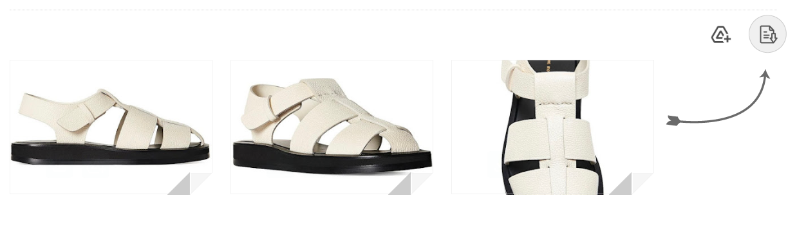

# Gmail Bulk Attachments Downloader

Gmail Bulk Attachments Downloader adds a toolbar button that downloads every attachment in the open Gmail conversation with a single click, preserving each file's original name, format, and size.

## Key Features
- Uses InboxSDK to request Gmail's official attachment download URLs instead of thumbnail proxies.
- Sanitises filenames so Chrome writes the exact Gmail title safely to disk.
- Falls back to DOM metadata when Gmail delays the download URL.
- Skips Drive items when Gmail refuses to expose the original link and logs a warning so you can fetch them manually if needed.

## Preview
Below is the toolbar button added by the extension:

## Installation
1. Download or clone this repository (GmailBulkAttachmentsDownload).
2. Open chrome://extensions in a Chromium-based browser and enable **Developer mode**.
3. Choose **Load unpacked** and select the GmailBulkAttachmentsDownload folder.

## Usage
1. Open any Gmail thread that contains attachments.
2. Click the download button that appears next to the built-in Drive actions.
3. Chrome queues individual downloads for every attachment using the original filenames. Check DevTools for warnings about Drive files that require manual retrieval.

## Manifest Notes
- Manifest V3 now ships with an inline description and author credit, removing the need for locale message bundles.
- Background downloads return explicit success or error responses, keeping the message channel stable during bulk transfers.
- Extension version bumped to **1.0.1** to track the latest styling and manifest updates.

## Recent Updates
- Rebranded the project and extension as **Gmail Bulk Attachments Downloader** with refreshed toolbar icons.
- Ensured every attachment download depends on InboxSDK getDownloadURL() before touching the DOM.
- Added URL normalisation, filename sanitisation, and DOM fallbacks to avoid JPEG/WebP proxy downloads.
- Logged informative warnings when Gmail withholds a Drive URL so you can connect a Gmail or Drive API fallback if needed.
- Normalised the toolbar icon CSS so the download button aligns with Gmail's native Drive action.

## License
This project is released under the MIT License. See [LICENSE](LICENSE) for details.

## Author
Katsopolis
